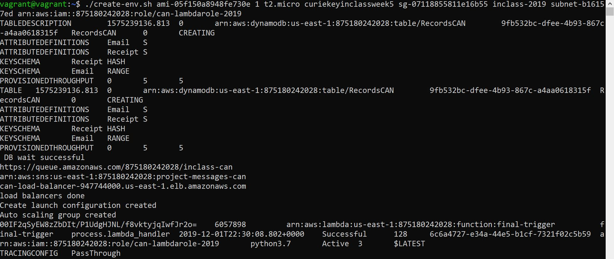
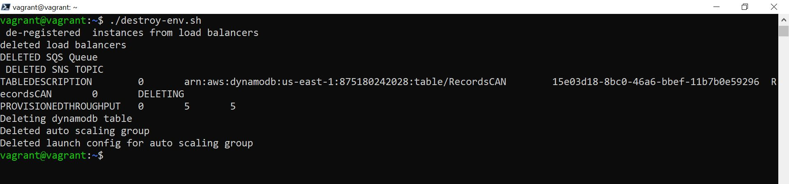
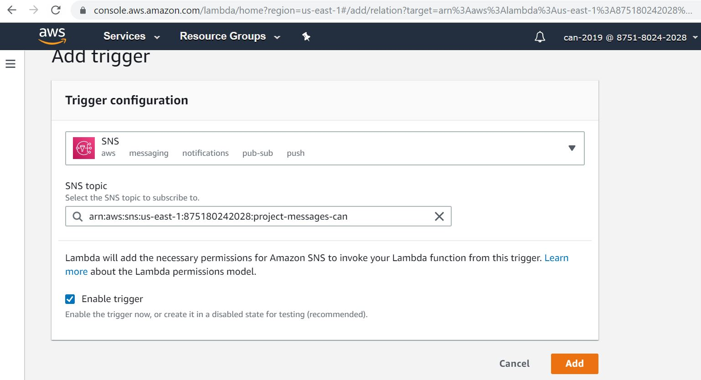
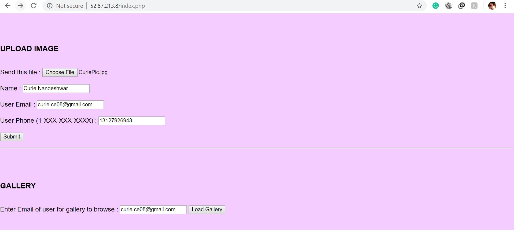
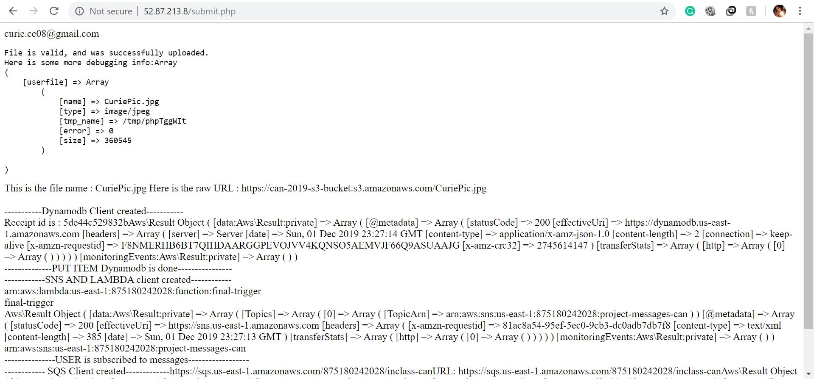
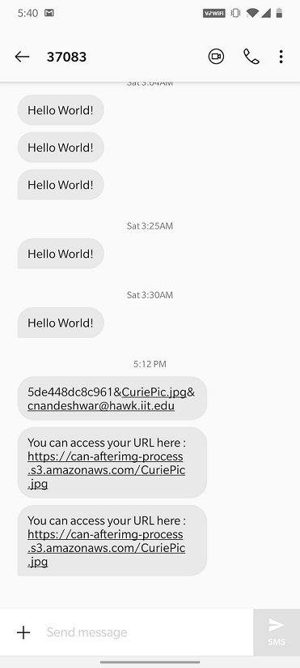
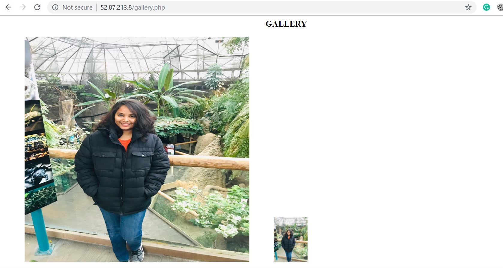

# Image Processing Project

## Technologies Used:
 - PHP
 - Python
 - AWS 
 - Linux shell scripting

### Steps and Information to run the project

### 1. Copy the files create-env.sh , install-app-env-front-end.sh and destroy-env.sh in your vagrant box.
### 2. Run the destroy-env.sh first just to be sure that everything ( ELB, Dynamodb , autoscaling , SNS and SQS) that might be running previously is terminated/ deleted.
### 3. create-env.sh :

Run create-env.sh to create SNS topic , SQS queue ,ELB load balancer and dynamodb database. There are 8 positional parameters which needs to be passed for creating all the mentioned instances. Sample script for running create-env.sh is as :

./create-env.sh ami-05f150a8948fe730e 1 t2.micro curiekeyinclassweek5 sg-07118855811e16b55 inclass-2019 subnet-b16157ed arn:aws:iam::875180242028:role/can-lambdarole-2019

Please Note:
- The order of the positional parameter is : Image ID, count, Instance Type, keypair name, security group id, I AM profile/role , subnet id and Lambda role arn 
- Use my custom AMI image ami-05f150a8948fe730e as it has the configuration and permission for cloning my github repo.
- Replace the keypair name ,security group, subnet id ad lambda role arn with that of yours.
### The availability zone is mentioned as us-east-1c while creating auto-scaling group. So please use subnet id of us-east-1c.*

- On successfully running, the below output is displayed:

### 4. install-app-env-front-end.sh:

- This file will install all the required dependencies in the instance to run the project. 

- The installation of all the dependencies will happen automatically as the launch configuration command in the create-env.sh file metions install-app-env-front-end.sh as user-data file.

- Dependencies which will be downloaded are : php for running the files, git hub cloning, python dependencies and composer.phar for downloading aws sdk.

Please Note :
- Please wait for 2-3 mins after the create-env.sh is run completely, as installation of all these dependencies takes time and the web pages might not run successfully if not installed completely.

### 5. destroy-env.sh:

- Running this file will destroy/delete/terminate all the SQS queue, SNS topic , dynamodb table , load balancers (elb) , autoscaling group and its launch config.

- On successfully running, the below output is displayed:

-----------------------------------------------------

### Screenshots of project flow:

### NOTE : Please select the lambda function "final-trigger" and add a SNS trigger manually for the lambda to trigger properly. Screenshot below:

1. Load index.php , please enter your number in correct format ( i.e. dont forget to enter 1 to get the message) and submit the png/jpg file you want to upload and to get the messages.

2. After submitting , the pic will get inserted in dynamodb database, SNS topics will be subscribed and will be displayed in the submit.php.

### Please NOTE: Please wait for 5 mins , as the lambda function takes time to process and hence the message will pop-up after lambda processes everything.  A Message with the S3 finished URL will be received on the phone number you have entered in index.php after the processing is completed.

### NOTE: The SNS sends messages randomly and not in order. So the messages might not appear in order of the pics sent in index.php. 

Screen shot for the message obtained on the phone number:

3. Use gallery.php to retreive the uploaded pic and its thumbnail image adjacent to it.
   
   Enter email address that you have used in index.php and load the gallery to navigate to gallery page.

